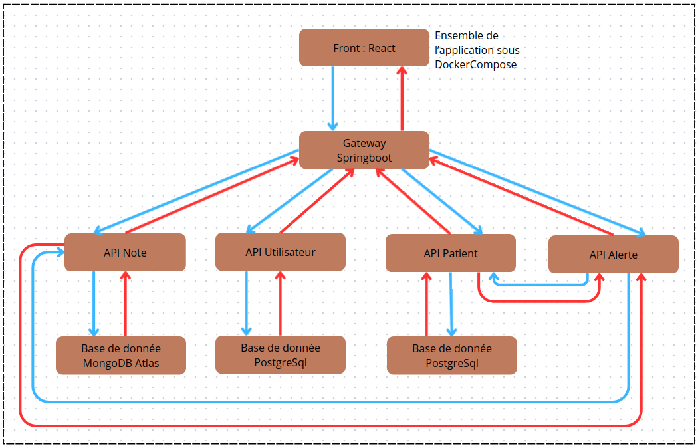

# Nom du projet

Medilabo

# Sommaire

1. [Nom du projet](#nom-du-projet)
2. [Résumé de l'application](#résumé-de-lapplication)
3. [Technologies](#technologies)
4. [Installation de l'application](#installation-de-lapplication)
5. [Lancer l'application](#lancer-lapplication)
6. [Architecture du projet](#architecture-du-projet)
7. [Microservice Patient](#microservice-patient)
8. [Microservice Utilisateur](#microservice-utilisateur)
9. [Microservice Note](#microservice-note)
10. [Microservice Alerte](#microservice-alerte)
11. [Gateway](#gateway)
12. [Frontend](#frontend)
13. [CI/CD](#cicd)
14. [Conteneurisation](#conteneurisation)
15. [Documentation](#documentation)
16. [Green Code](#green-code)
17. [En cours de développement](#en-cours-de-développement)
18. [Idée de développement](#idée-de-développement)

## Résumé de l'application

Medilabo est le projet 9 de la formation Développeur Java d’OpenClassrooms.
L’application est conçue pour les professionnels de santé afin de faciliter la gestion des patients.

### Fonctionnalités principales :
- Accès à la liste complète des patients.
- Consultation des informations personnelles et des transmissions (notes médicales).
- Ajout, modification et suppression de patients.
- Rédaction de notes pour suivre l’évolution médicale.
- Détection et alerte en cas de risque de diabète.

## Technologies

### 1. Langages et frameworks principaux

- Backend : Java 21 (Temurin) avec Spring Boot
    - Spring Web
    - Spring Data JPA
    - Spring Data MongoDB
    - Spring Cloud
    - Spring Cloud Gateway
    - Spring Cloud OpenFeign
    - Spring DevTools
- Frontend : JavaScript avec React

### 2. Les bases de données
- Developpement et Production : 
    - NoSql avec MongoDB (MongoDB Atlas)
    - Sql avec PostgreSql (Supabase)
- Test : 
    - TestContainer (pour le NoSql)
    - H2 Database (pour le Sql)
- Normalisation : Les bases de données Sql (patient et utilisateur) suivent le principe 3NF.

### 3. La sécurité
- JsonWebToken
- SpringSecurity
- Dotenv

### 4. Documentation & outils développeur
- Javadoc
- Swagger (OpenAPI)
- Lombok
- Jackson

### 5. Tests
- Mockito
- Spring Test

### 6. Intégration & déploiement
- Maven
- Docker & Docker Compose
- GitHub Actions (CI/CD)

### 7. Logging & monitoring
- Log4j
- Spring Actuator

## Installation de l'application

Pour démarrer le projet, il est nécessaire d'installer les packages de chaque microservice. Dans chaque microservice, vous pouvez utiliser le terminal avec la commande :  `mvn clean package`. Cela génèrera un fichier .jar dans chacun des microservices. Les .jar sont les fichiers qui seront utilisé pour démarrer l'application.
A noter que le microservice Front n'a pas besoin de mvn clean package car utilisation de React (javascript).

## Lancer l'application

Ensuite, pour démarrer le projet, il faut aller à la racine du projet medilabo, où se trouve le Docker-compose, lancer le terminal avec la commande : docker compose up --build. Cela suivra les instruction du fichier docker compose, décrit plus loin dans le README, section Conteneurisation.

## Architecture du projet

Le projet se compose de 5 microservives liés ensemble grâce à la conteneurisation avec Docker.

Voici le schema récapitulatif : 

### Les microservices : 
- patient => pour la gestion des patients (CRUD)
- utilisateur => pour la gestion des utilisateurs (CRUD + login)
- notes => pour la gestion des notes (CRUD)
- alerte => pour alerter l'utilisateur sur les risques d'apparition du dabète du patient (info du patient + notes)
- gateway => pour filtrer et redistribuer les requêtes reçues du Front vers les API 
Ainsi que d'un front => pour la vue utilisateur (navigateur)

## Microservice Patient

Le microservice patient permet de faire les opérations CRUD sur l'objet Patient. 

### Objet Patient : 
- id : Long
- prenom : String
- nom : String
- dateNaissance : Date
- adresse : String
- telephone : String
- genre : String
- dateCreation : LocalDate
- dateModification : LocalDate

### Base de donnée
- PostgreSql (SQL), mise sur le cloud Supabase
- H2 Database, pour les tests.
- Normalisation en 3NF

### Architecture :
- controller
- service (implementant une interface)
- repository
- model

La sécurité est gérée à partir de la gateway.

## Microservice Utilisateur

Le microservice utilisateur permet les opérations CRUD sur l'objet Utilisateur, ainsi que la gestion de l'authentification.

### Objet User : 
- id : Long
- username : String
- nom : String
- prenom : String
- role : String
- password : String
La normalisation en 3NF est mise en place.

### Base de donnée :
- postgreSql (SQL), mise en place sur le cloud Supabase.
- H2 Database, pour les tests.
- Normalisation en 3NF

### Architecture :
- controller
- service (implementant une interface)
- repository
- model
- configuration de sécurité

### Sécurité : 
- Utilisation de Spring Security et authentification manager. 
- Utilisation de token avec Json Web Token
- Le JWT contient : id, username, nom, prenom, role.
- Le token est nécessaire pour toutes les requêtes venant du front vers la gateway.

## Microservice Note

Le microservice note permet les opérations CRUD sur l'objet Note.

### Objet Note : 
- id : String
- patientId : Long
- medecin: Medecin
- note : String
- Pas de normalisation en 3NF car imbrique l'objet médecin. 3NF non obligatoire en NoSql.

Le patientId est une clé étrangère en direction de la table Patient. La base de donnée étant en NoSql, le 3NF ne s'applique pas. L'objet Medecin est contenu dans l'objet note afin de permettre une meilleure scalabilité des notes. 

### Objet Medecin : 
- id : String
- userId : Long
- nomMedecin: String
- prenomMedecin: String
- Normalisation en 1NF car nom et prenom dépendent de userId (dépendance transitive).

### Base de donnée : 
- MongoDB (NoSql)
- TestContainer pour les tests

### Architecture :
- controller
- service (implementant une interface)
- repository
- model

### Sécurité : 
- le Jwt est mise en place afin de pouvoir extraire l'id, le nom et le prénom de l'utilisateur afin de les voir s'afficher dans le front pour une transmission donnée.
- Ajout de note est accessible à partir de la page information du patient.

## Microservice Alerte

Le microservice alerte permet d’analyser les données d’un patient et ses notes pour détecter un risque de diabète.

### Architecture : 
- controller
- service (implementant une interface)
- model

### Risque de diabète : 
- none, 
- borderline, 
- inDanger,
- EarlyOnset.

### Appel API :
Ce microservice reprend les modèles de données des API Note et Patient afin de faire un appel avec Feign.

**Méthodes** : 
- getAllNotesPatient() de l'API Note
- getPatientById() de l'API Patient
- getAgePatient() de l'API Patient

### Fonctionnement : 
- Utilisation de feign pour appeler les microservices patient et notes
- Une liste de mots clé recherché dans les notes est visible dans le service
- Prend en compte l'age et le genre du patient

Pour réaliser ce traitement, ce service nécessite l'utilisation de feign pour faire des appels sur les microservices patient et notes.

## Gateway

La gateway est le point d'entrée de l'application.

### Fonctionnalité : 
- Reçoit les requêtes du front
- Filtre et distribue vers le microservice concerné
- Filtrage via Spring Security et JWT

## Frontend

La vue utilisateur est réalisé avec React. 

## CI/CD

GitHub Actions est utilisé pour l’intégration continue (CI) des microservices. Le pipeline CI se déclenche automatiquement lors des push ou des pull requests sur la branche main.
Il n'est pas prévu encore de déploiement réel de l'application.

Le fichier docker-ci.yml se situe à la racine du projet dans le dossier .github/workflows.

**Déploiement**
Deux solutions sont en cours de réflexion.
- Différencier le Back du Front. Le Front peut être déployer sur Github et le Back sur 
- Déployer directement le Docker Compose sur un serveur distant (Ex : OVH, Azure VM...) ou sur un serveur spécialisé Docker (Ex : Render, Fly.io...)

### Étapes principales du pipeline :
- Checkout du code : récupération de la dernière version du dépôt.
- Configuration de Java 21 : installation et mise en cache des dépendances Maven.
- Build des microservices : compilation de chaque microservice sans exécuter les tests.
- Tests unitaires : exécution des tests unitaires de tous les microservices et de la gateway.
- Docker Compose : build et démarrage des conteneurs pour les tests d’intégration.
- Tests d’intégration : exécution des tests d’intégration de tous les microservices et de la gateway.
- Arrêt des conteneurs Docker : nettoyage des ressources après les tests.

### Variables d’environnement utilisées (secrets dans github) :
- JWT_SECRET : clé secrète pour l’authentification JWT.
- SPRING_DATA_MONGODB_URI : URI de connexion à la base MongoDB.
- SPRING_DATA_POSTGRE_URI : URI de connexion à la base PostgreSQL.

## Contenerisation

Chaque microservice de l’application est conteneurisé avec Docker pour assurer un déploiement homogène et reproductible. Tous les microservices suivent une structure similaire pour leur Dockerfile.
### Exemple : 
- Utilisation d'une base légère contenant Java 21 pour exécuter nos microservices.
- Installation de curl dans le conteneur (utile pour des tests ou vérifications réseau. La suppression du cache apt permet de garder l’image légère.
- Copie le fichier JAR généré par Maven dans le conteneur (mvn clean package à faire en amont sur le microservice)
- Commande à exécutée au démarrage du conteneur : lancement du microservice.
Tous les microservices suivent cette même logique, chacun avec son propre JAR.

Chaque microservice peut être lancé indépendamment en lançant à la racine de chaque microservice :
- `docker build -t nom-du-projet . ` => -t pour donner un nom + . signifie dans ce dossier
- `docker run --env-file .env -p 8080:8080 --name nom-du-container nom-du-projet` => se lance en injectant les variables d'environnement + map les ports (à modifier selon le application.properties) + donne un nom au container du projet
- `docker rm nom-du-container` => supprime le container
- `docker rmi nom-du-projet` => supprime le projet

Mais il est privilégié de lancer l'application avec le Docker Compose

Le projet utilise Docker pour containeriser les microservices et le front, et Docker Compose pour les orchestrer facilement.
Docker Compose

### Le fichier docker-compose.yml 
Il définit tous les services du projet et se situe à la racine du projet. Il contient : 
- api-utilisateur, api-patient, api-note, api-alerte : microservices Java Spring Boot.
- gateway : passerelle API qui centralise les requêtes vers les microservices.
- frontend : application React pour l’interface utilisateur.

### Chaque service contient :
- build : le chemin vers le Dockerfile du microservice.
- container_name : nom du conteneur Docker pour faciliter les commandes.
- ports : redirection des ports du conteneur vers le poste local.
- networks : tous les conteneurs sont connectés au réseau medilabo-net.
- environment : variables d’environnement (ex. URI des bases de données, secrets JWT) stockées dans un .env à la racine du projet
- healthcheck : vérification automatique de la santé du service via l’endpoint /actuator/health.

### Dépendances entre services :
- Le gateway ne démarre que lorsque tous les microservices sont sains (depends_on avec service_healthy).
- Le frontend dépend du gateway pour fonctionner (depends_on avec service_started).

### Réseau :
- Tous les conteneurs utilisent un réseau bridge nommé medilabo-net.
- Cela permet aux microservices et au front de communiquer entre eux facilement.

## Documentation

La documentation est réalisé avec : 
- swagger => accessible depuis la page d'accueil pendant le développement de l'application
- javadoc => pour mettre à jour la javadoc 

## Green Code

Le projet Medilabo a aussi pour vocation, à long terme, d'être vertueux sur le plan environnemental. Une démarche de green code en intégrant des pratiques qui réduisent l'impact écologique de l'application sera mise en place progressivement.

### L'objectif du green code est de :
- Réduire la consommation énergétique des serveurs.
- Minimiser l'empreinte carbone de l'application.
- Prolonger la durée de vie des équipements informatiques des utilisateurs.

### Propositions pour l'évolution du projet vers le green code (amélioration continue) :

**Optimisation du frontend**
- Mise en cache : Utiliser le cache du navigateur pour les ressources statiques (CSS, JS, images) afin de réduire le nombre de requêtes et le volume de données téléchargées.
- Minification : Minifier les fichiers CSS et JavaScript pour en réduire la taille et accélérer leur chargement.

**Optimisation du backend**
- Nettoyage du code : Supprimer les dépendances non utilisées, les commentaires inutiles et le "code mort" pour alléger l'application.
- Refactorisation des méthodes : Éviter la redondance et les calculs inutiles pour rendre le code plus performant et moins gourmand en ressources CPU.
**Architectures et infrastructures** :
- Images Docker légères : Utiliser des images de base minimales comme openjdk:21-jre-slim pour réduire la taille des conteneurs.
- Scalabilité à la demande (mise en veille) : À plus long terme, nous pourrions explorer des solutions comme la "mise à l'échelle à zéro" pour des microservices peu sollicités, comme le service alerte. Cette pratique permettrait d'arrêter un conteneur lorsqu'il n'est pas utilisé et de le relancer uniquement en cas de besoin.
- Mettre à jour les versions des dépendance : La nouvelle version a un code souvent plus optimisé que l'ancien.

### Outils possible
- Docker stats
- Ligthouse (front)
- GreenFrame

L'objectif est de faire de Medilabo un projet qui allie performance, responsabilité et respect de l'environnement.

## En cours de développement

Est en cours de développement la possibilité de créer des rendez-vous. Le microservice-rdv a été créé et a commencé à être implémenté. L'objectif étant de permettre au médecin ou à la secrétaire de mettre un rendez-vous médical pour le patient. L'objet rendez-vous pourrait être composé d'une date, une heure, un professionnel, des remarques, des documents si besoin. Aussi, il pourrait être imaginé un service d'alerte et une récupération des rendez-vous dans une liste pour chaque professionnel. C'est à dire la mise en place d'un planning de rendez-vous intégrer directement dans l application.

## Idée de développement

- Mettre en place des rôles
    - Secrétaire pour accéder au information administratives du patient et de lui proposer un rendez-vous
- Administrateur pour ajout de nouveau utilisateur
- Medecins ou autres profesionnels pouvant accéder aux informations du patient et faire une note
- Ajouter des documents (scanner, ordonnance, etc...)
- Ajouter une planification de rendez-vous
- Accéder à ses patients favoris (file active)
- Accéder à son planning
